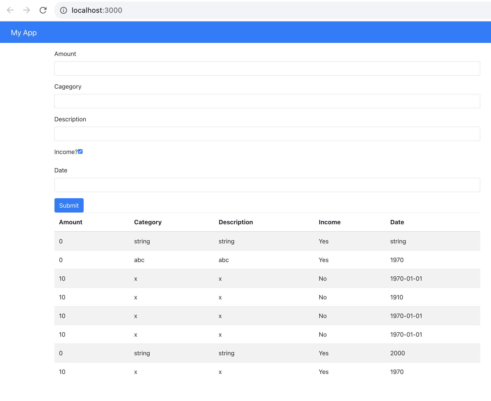
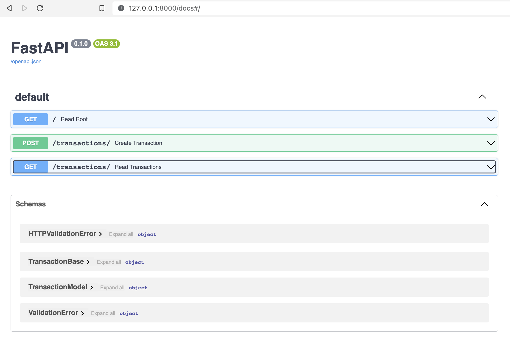

## Build a simple app using FastAPI and React

Tutorial source:   
How to build a React + FastAPI application (Full Stack Guide)  
https://www.youtube.com/watch?v=0zb2kohYZIM  

## Installation 

```bash 
mkdir fastapi_react_sqlalchemy
cd fastapi_react_sqlalchemy
mkdir FastAPI 
mkdir React 

python -m venv env 
source env/bin/activate 

pip  install fastapi "uvicorn[standard]" sqlalchemy

cd FastAPI 
touch main.py models.py database.py

code .  

cd FastAPI
uvicorn main:app --reload 

check api 
http://127.0.0.1:8000/docs


cd React 
# check node installation 
node -v   
npx create-react-app finance-app 


https://getbootstrap.com/docs/4.0/getting-started/introduction/

  </body>

index.html, paste below copied from above url, before tag <link>
    <!-- Bootstrap CSS -->
    <link rel="stylesheet" href="https://cdn.jsdelivr.net/npm/bootstrap@4.0.0/dist/css/bootstrap.min.css" integrity="sha384-Gn5384xqQ1aoWXA+058RXPxPg6fy4IWvTNh0E263XmFcJlSAwiGgFAW/dAiS6JXm" crossorigin="anonymous">

index.html, paste below copied from above url, before tag </body>
    <script src="https://cdn.jsdelivr.net/npm/bootstrap@4.0.0/dist/js/bootstrap.min.js" integrity="sha384-JZR6Spejh4U02d8jOt6vLEHfe/JQGiRRSQQxSfFWpi1MquVdAyjUar5+76PVCmYl" crossorigin="anonymous"></script>

# install api axios 
npm install axios

npm start 


```

## Screenshot 


